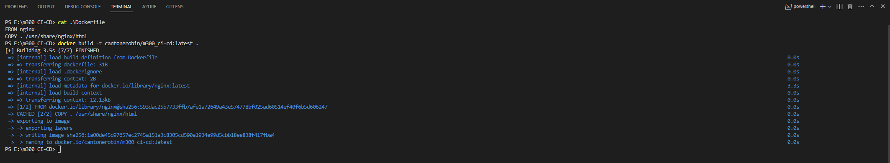

The Dockerfile can be found here: https://github.com/cantonerobin/m300_CI-CD/blob/main/Dockerfile

It is very simple, you only have to choose nginx as the base image and copy the current directory into it.

Dockerfile
``` 
FROM nginx
COPY . /usr/share/nginx/html
```

## Logs

Here you can see that the docker image is successfully build.



Ressource: https://tecadmin.net/tutorial/docker-run-static-website