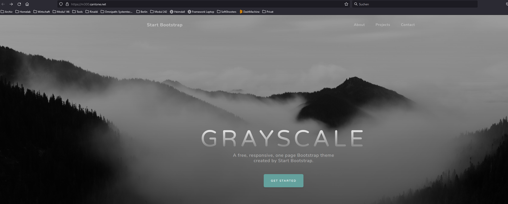

The GitHub Actions can automatically build a new image and push it to the registry at DockerHub when the developer releases changes. 

## DockerHub Access Token 
For this to work we have to create an Access Token in Dockerhub. This will later be used in the GitHub Action.

## GitHub Secrets
For the GitHub Action we have to create 2 Secrets. This secret will be used in the GitHub Action later.
![[Github_Secrets.png]]

## GitHub Action
With GitHub Action we can trigger a docker Build Job whenever the developer does push to the main branch.

This file can be found in the repository here: https://github.com/cantonerobin/m300_CI-CD/blob/main/.github/workflows/docker-image.yml

docker-image.yml
``` yaml
name: Build and Publish

on:
  # run it on push to the main repository branch
  push:
    branches: [main]  

jobs:
  # define job to build and publish docker image
  build-and-push-docker-image:
    name: Build Docker image and push to repositories
    # define on which runner this shall run
    runs-on: ubuntu-latest

    # checkout repository
    steps:
      - name: Checkout code
        uses: actions/checkout@v3

      # setup Docker environment
      - name: Set up Docker Buildx
        id: buildx
        uses: docker/setup-buildx-action@v2

	  # Login to DockerHub
      - name: Login to DockerHub
        uses: docker/login-action@v2
        with:
          username: ${{ secrets.DOCKERHUB_USERNAME }}
          password: ${{ secrets.DOCKERHUB_TOKEN }}

	  # Build 
      - name: Build image and push to Docker Hub and GitHub Container Registry
        uses: docker/build-push-action@v2
        with:
          # relative path to the place where source code with Dockerfile is located
          context: ./
          # Note: tags has to be all lower-case
          tags: |
            cantonerobin/modul300_ci-cd:latest
          push: true
      - name: Image digest
        run: echo ${{ steps.docker_build.outputs.digest }}

```

## Logs
Here you can see an overview of the last 3 runned Pipelines.
![[GitHub_Action_Overwiew.png]]

Here you see all the steps the action performed:
![[GitHub_Action_Steps.png]]

The most importing step for us is this one:
![[GitHub_Action_Build&Push.png]]
Here we can see that the image is successfully build and uploaded to DockerHub.


Ressources: https://event-driven.io/en/how_to_buid_and_push_docker_image_with_github_actions/