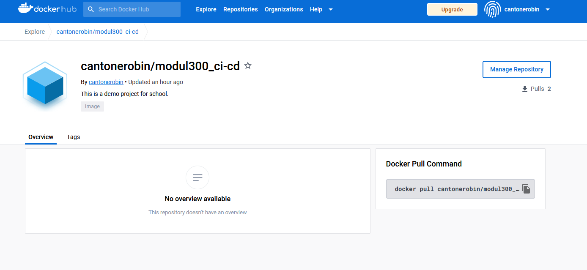
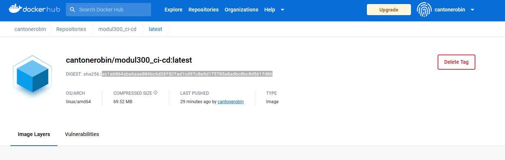
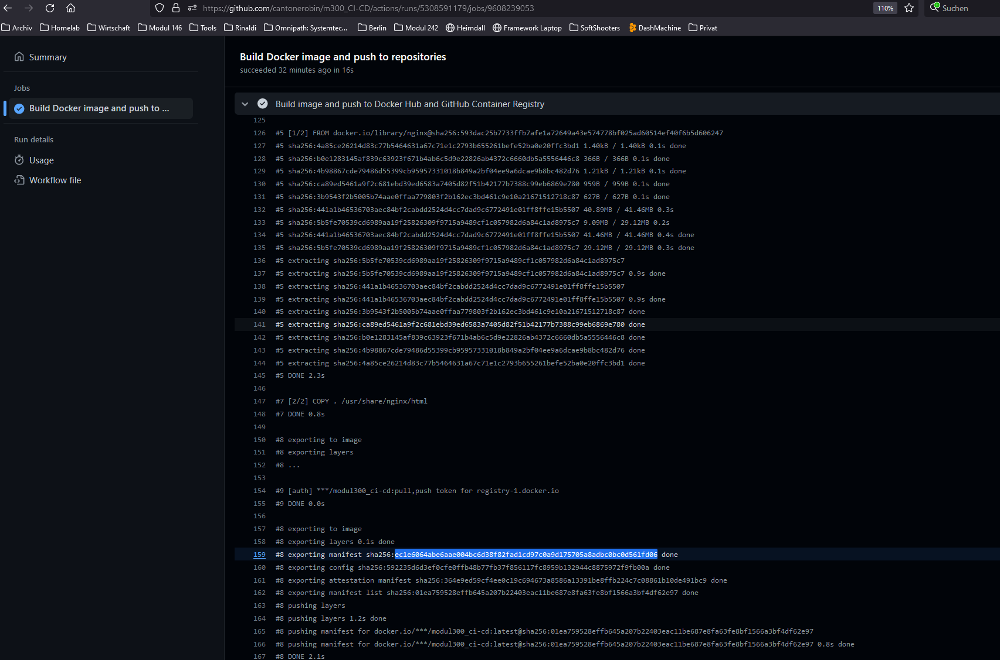

When the Github Action is finished, we can see the new Image in the registry.

To check that all has worked as intended we can compare the Image digest from the registry with the one from the latest GitHub Action.

As you can see, the digest for this Image is: ec1e6064abe6aae004bc6d38f82fad1cd97c0a9d175705a8adbc0bc0d561fd06

Now we can search the logs from the GitHub Action for this Digest.

